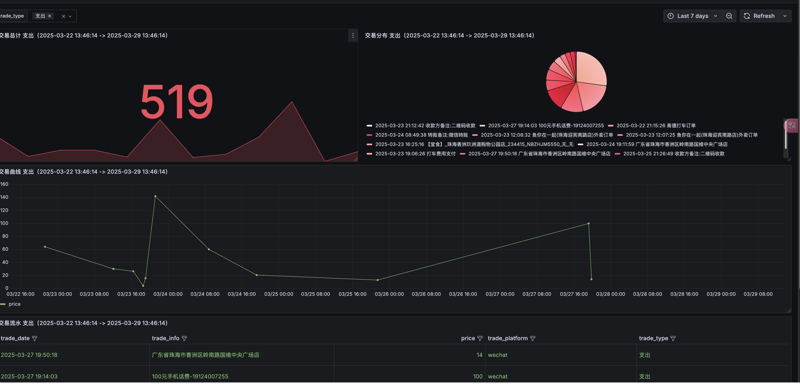
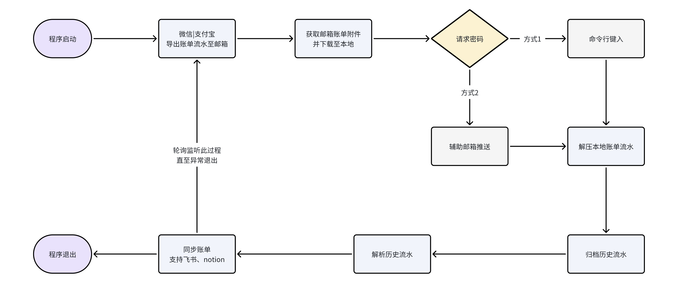
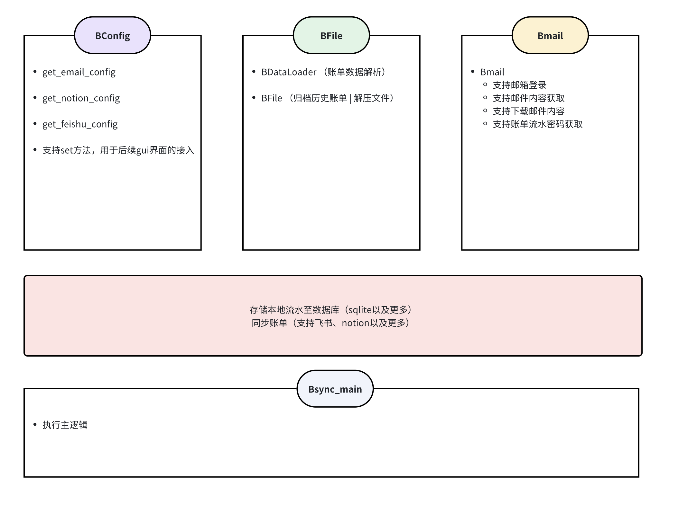

# 账单同步工具（微信|支付宝）
**主要功能**: 基于解析微信支付宝导出账单流水，利用notion等三方笔记实现账单分析展示
- 灵感来源此项目：https://github.com/edge-sky/Bills-save
- 欢迎提出意见，以及有更好的思路，欢迎沟通
- 改动内容
  - 基本是根据原有项目，进行了二次魔改，重构了部分逻辑，提升可维护性
  - 在保持原有功能基础上，新增了如下变动
    - 支持同步到飞书文档，结合飞书仪表盘，可做到更便捷的账单分析效果（主要notion图表是付费功能）
    - 调整历史账单文件的归档时机，规避了原有代码中仅在notion上传成功时，触发归档
    - 支持了命令行键入密码

- 后续计划支持如下
  - 支持dump历史账单至sqlite，可用于接入更多分析看板
  - 优化获取邮件逻辑
  - 进一步优化原有冗余逻辑
  - 支持gui界面

## changeLog

**20250329** 支持dump账单信息至sqlite 

## 效果如图
- notion效果

- 飞书效果

- 基于sqlite数据进行的grafana展示

## 整体功能逻辑

## 整体项目设计
